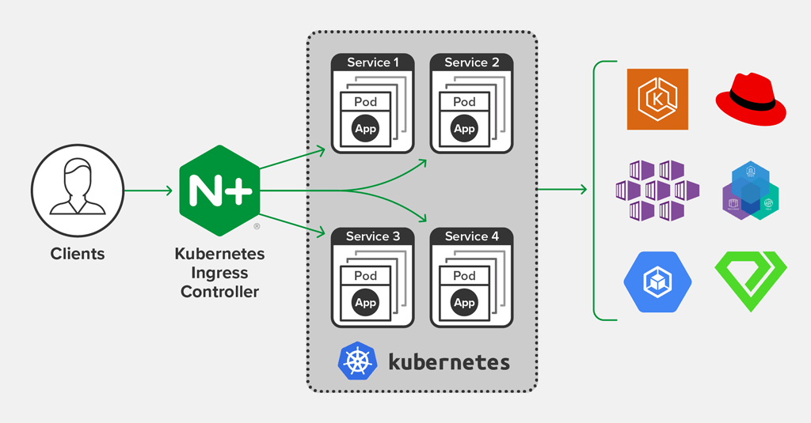

# Prerequisites and used components

## Kubernetes cluster provisioning

First need to provisioned k8s cluster (EKS on AWS in my case), terraform scripts to spin up EKS cluster attached [terraform folder](terraform)
Also instructuions of how to provision EKS using terraform you can find in my repo: https://github.com/warolv/eks-demo

  * VPC created with range: 172.16.0.0/16 

  * 2 public/2 private subnets (Production cluster usually will be spinned cross 3 AZ for HA)

  * worker nodes are t3.medium 'on-demand' EC2 instances (no need for spots in this demo)

  * Ingress Nginx will be deployed on cluster after provisioning

  * Cert Manager will be deployed to cluster after provisioning 

### What is NGINX Ingress?

ingress-nginx is an Ingress controller for Kubernetes using NGINX as a reverse proxy and load balancer.
https://github.com/kubernetes/ingress-nginx



### What is a cert-manager?

cert-manager is a native Kubernetes certificate management controller. It can help with issuing certificates from a variety of sources, such as Let’s Encrypt, HashiCorp Vault, Venafi, a simple signing key pair, or self signed.
It will ensure certificates are valid and up to date, and attempt to renew certificates at a configured time before expiry.
It is loosely based upon the work of kube-lego and has borrowed some wisdom from other similar projects such as kube-cert-manager.

### Using Ingress Nginx as ingress and Cert Manager to issue self signed certificates

I will use Ingress Nginx as ingress controller and Cert Manager to issue 'self signed' certificates for this solution (also may be used in production use cases to issue Let's Encrypt certs.)

You can read in my post how I am using those components to secure traffic to your application: https://talks.cloudify.co/secure-traffic-to-your-application-with-kubernetes-and-cert-manager-cc2b44d29beb


# Problem

* Deploy 2 services on Kubernetes - which will function via http/s

* Install and configure two routes, each service should expose an endpoint
named
  * "/routea" pointing to service A (nginx server deployed to a-ns namespace)
  * "/routeb" pointing to service B (nginx server deployed to b-ns namespace)


# Solution
  I will use battle tested solutions like nginx-ingress and cert-manager in my solution
  
  In case you not deployed ingress-nginx and cert manager as part of EKS provisioning with terraform, you can do it manually with helm:
  
```bash
  # ingress-nginx
  $ helm repo add nginx-stable https://helm.nginx.com/stable
  $ helm repo update
  $ helm install my-release nginx-stable/nginx-ingress

  # cert-manager
  $ helm repo add jetstack https://charts.jetstack.io
  $ helm repo update
  $ kubectl apply -f https://github.com/cert-manager/cert-manager/releases/download/v1.7.1/cert-manager.crds.yaml
  $ helm install \
    cert-manager jetstack/cert-manager \
    --namespace cert-manager \
    --create-namespace \
    --version v1.7.1 \
```

Let's deploy first nginx server to 'a-ns' namespace
```bash
  $ kubectl create ns a-ns
  $ kubectl create deployment nginxa --image=nginx -n a-ns
  $ kubectl expose deployment nginxa --port=80 -n a-ns
```

Create ingress rule for the first service
```yaml
apiVersion: networking.k8s.io/v1beta1
kind: Ingress
metadata:
  name: ingress-nginxa
  annotations:
    kubernetes.io/ingress.class: "nginx"
    nginx.ingress.kubernetes.io/rewrite-target: /$1
spec:
  rules:
  - host: nginx.your-domain.com
    http:
      paths:
      - path: /routea
        backend:
          serviceName: nginxa
          servicePort: 80
```

Deploy ingress-nginxa.yaml
```bash
$ kubectl apply -f ingress-nginxa.yaml
```

Let's deploy second service to 'b-ns' namespace
```bash
  $ kubectl create ns b-ns
  $ kubectl create deployment nginxb --image=nginx -n b-ns
  $ kubectl expose deployment nginxb --port=80 -n b-ns
```

Create ingress rule for the second service
```yaml
apiVersion: networking.k8s.io/v1beta1
kind: Ingress
metadata:
  name: ingress-nginxb
  annotations:
    kubernetes.io/ingress.class: "nginx"
    nginx.ingress.kubernetes.io/rewrite-target: /$1
spec:
  rules:
  - host: nginx.your-domain.com
    http:
      paths:
      - path: /routeb
        backend:
          serviceName: nginxb
          servicePort: 80
```

Deploy ingress-nginxb.yaml
```bash
$ kubectl apply -f ingress-nginxb.yaml
```

## Enabling https for first and second services

Will use cert-manager with issuer created for self-signed certificates:

First service

```yaml
apiVersion: cert-manager.io/v1
kind: Issuer
metadata:
  name: selfsigned-issuer
  namespace: a-ns
spec:
  selfSigned: {}
```

```bash
$ kubectl apply -f issuera.yaml
```

Changes to ingress to issue automatically new certificate:

```yaml
apiVersion: networking.k8s.io/v1beta1
kind: Ingress
metadata:
  name: ingress-nginxa
  annotations:
    kubernetes.io/ingress.class: "nginx"
    nginx.ingress.kubernetes.io/rewrite-target: /$1
    cert-manager.io/issuer: "selfsigned-issuer"
spec:
  rules:
  - host: nginx.your-domain.com
    http:
      paths:
      - path: /routea
        backend:
          serviceName: nginxa
          servicePort: 80
  tls:
  - hosts:
    - nginx.your-domain.com
    secretName: nginxa-secret
```

Look at 'tls' part and 'cert-manager.io/issuer: "selfsigned-issuer" lines. 

Simple integration of cert-issuer into ingress-nginx makes it easy for implementation.
Now you can access service with https (you will see warning because it's self signed cert and not public CA like Let's encrypt)

Second service

```yaml
apiVersion: cert-manager.io/v1
kind: Issuer
metadata:
  name: selfsigned-issuer
  namespace: b-ns
spec:
  selfSigned: {}
```

```bash
$ kubectl apply -f issuerb.yaml
```

Changes to ingress to issue automatically new certificate:

```yaml
apiVersion: networking.k8s.io/v1beta1
kind: Ingress
metadata:
  name: ingress-nginxb
  annotations:
    kubernetes.io/ingress.class: "nginx"
    nginx.ingress.kubernetes.io/rewrite-target: /$1
    cert-manager.io/issuer: "selfsigned-issuer"
spec:
  rules:
  - host: nginx.your-domain.com
    http:
      paths:
      - path: /routea
        backend:
          serviceName: nginxb
          servicePort: 80
  tls:
  - hosts:
    - nginx.your-domain.com
    secretName: nginxb-secret
```

You can find all manifests in [manifests](/manifests) folder.